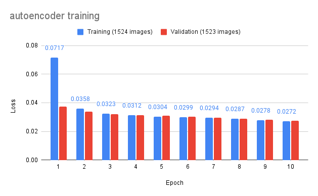

# AI-Profiles

AI toolbox for [A-Profiles](https://github.com/AugustinMortier/a-profiles).
The primary goal of this tool is to provide a robust **cloud detection**.

## Autoencoder training

autoencoder training

## Deep Embedded Clustering

eg: 0-100-20000-0000001-A - 2024/07/02

More information can be found in this [presentation](https://docs.google.com/presentation/d/1z6y5nCokZjAGNgXZBGeQyZ3vgjH6tkwxM01Jh9Wl1VQ/edit?usp=sharing).